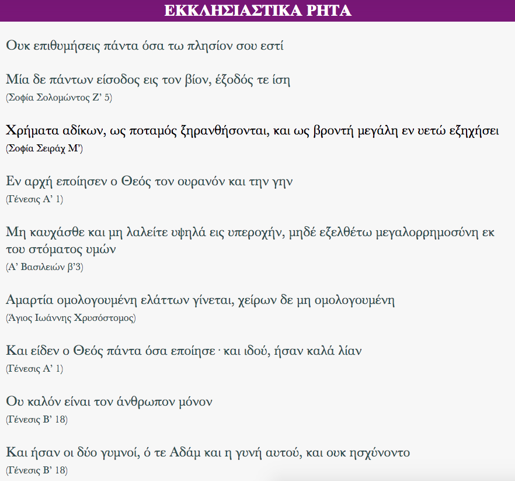

Σύντομα ρητά/αποφθεύγματα αντλούμενα κατά κύριο λόγο από τις παρακάτω πηγές:
· Παλαια Διαθήκη
· Ευαγγέλια
· Επιστολές Αποστόλων
· Καινή Διαθήκη (άλλα)

Η εφαρμογή δεν απαιτεί σύνδεση στο διαδίκτυο

<b>Google Play:</b> [https://play.google.com/store/apps/details?id=appinventor.ai_fsiamp.EKSOMOLOGITARIO](https://play.google.com/store/apps/details?id=appinventor.ai_fsiamp.EKKLISIASTIKARITA)

